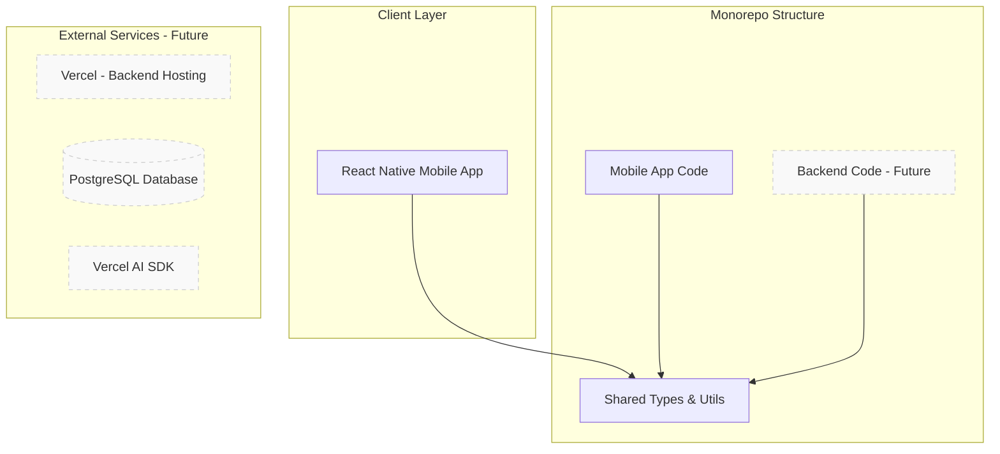
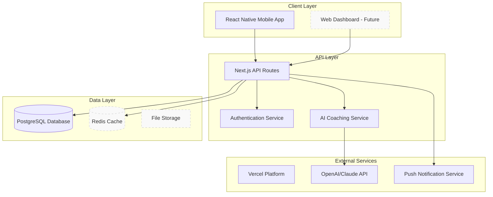
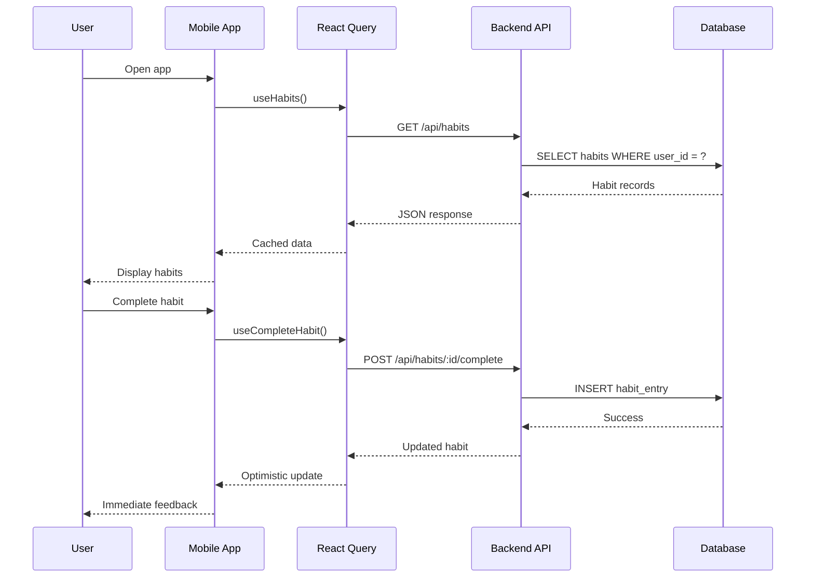
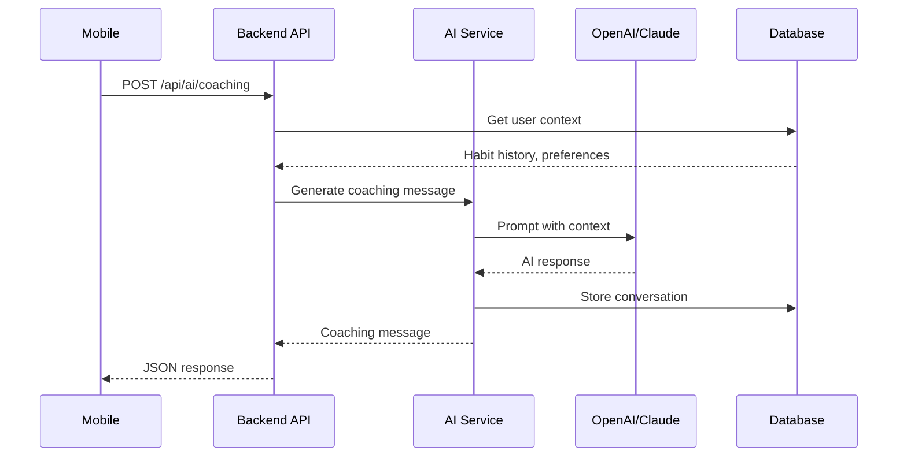

# Better You - Technical Architecture

This document outlines the technical architecture, design decisions, and evolution strategy for the Better You platform.

## Overview

Better You is designed as a **production-grade, scalable personal development platform** that grows from a simple MVP to a distributed system capable of serving thousands of users.

### Design Philosophy

1. **Start Simple, Scale Incrementally**: Begin with proven technologies, add complexity only when needed
2. **Type Safety Throughout**: End-to-end type safety from database to mobile app
3. **Offline-First Mobile**: Mobile app works offline, syncs when connected
4. **AI as Enhancement**: AI coaching enhances human agency, doesn't replace it
5. **Observable by Design**: Comprehensive logging, metrics, and monitoring from day one

---

## System Architecture

### Current State (Phase 1: MVP)



### Target State (Phase 3: Production)



---

## Technology Stack

### Mobile App (React Native)

#### Core Technologies
- **React Native 0.79.5**: Latest stable version with New Architecture
- **Expo SDK 53**: Managed workflow for rapid development
- **TypeScript 5.9.2**: Strict type checking enabled
- **Expo Router**: File-based routing system

#### State Management
- **TanStack React Query**: Server state management and caching
- **React Hooks**: Local component state
- **MMKV**: High-performance local storage
- **Zustand**: Global client state (future)

#### UI & Styling
- **React Native**: Native components
- **Design Tokens**: Consistent theming system
- **Expo Vector Icons**: Icon library
- **React Native Reanimated**: Smooth animations

#### Developer Experience
- **ESLint + Prettier**: Code quality and formatting
- **Husky + lint-staged**: Pre-commit hooks
- **Jest + Testing Library**: Testing framework
- **GitHub Actions**: CI/CD pipeline

### Backend (Next.js) - Future

#### Core Technologies
- **Next.js 15+**: App Router for modern React patterns
- **TypeScript**: Shared types with mobile app
- **Vercel**: Hosting and deployment platform
- **PostgreSQL**: Primary database

#### API Design
- **REST APIs**: Simple, predictable endpoints
- **Zod Validation**: Runtime type checking
- **Error Handling**: Consistent error responses
- **Rate Limiting**: API protection

#### AI Integration
- **Vercel AI SDK**: AI orchestration
- **OpenAI/Claude**: LLM providers
- **Async Processing**: Background AI tasks
- **Context Management**: Conversation history

### Database Design

#### Schema Strategy
- **Schema-first**: Database migrations drive development
- **Normalized Design**: Reduce data duplication
- **Audit Trails**: Track all changes
- **Soft Deletes**: Preserve data integrity

#### Key Entities
```sql
-- Users
users (id, email, name, created_at, updated_at)

-- Habits
habits (id, user_id, title, description, frequency, difficulty, category, is_active, created_at, updated_at)

-- Habit Entries
habit_entries (id, habit_id, date, completed, notes, mood, created_at)

-- AI Conversations
ai_conversations (id, user_id, context, created_at)
ai_messages (id, conversation_id, role, content, created_at)

-- User Sessions
user_sessions (id, user_id, token, expires_at, created_at)
```

---

## Data Flow

### Mobile App Data Flow



### AI Coaching Flow



---

## Design Decisions

### 1. Monorepo Structure

**Decision**: Use npm workspaces for monorepo management

**Rationale**:
- Shared types between mobile and backend
- Consistent tooling and dependencies
- Simplified deployment coordination
- Better code reuse

**Alternatives Considered**:
- Separate repositories (harder to maintain consistency)
- Lerna (more complex than needed)
- Yarn workspaces (npm workspaces are sufficient)

### 2. Mobile-First Architecture

**Decision**: Build mobile app first, backend second

**Rationale**:
- Mobile is the primary user interface
- Can prototype features with mock data
- Validates user experience early
- Backend can be designed around mobile needs

**Trade-offs**:
- Some features require backend integration
- Mock data needs to be maintained
- May need to refactor mobile code when backend is ready

### 3. React Query for State Management

**Decision**: Use React Query for server state, React hooks for local state

**Rationale**:
- Excellent caching and synchronization
- Optimistic updates out of the box
- Background refetching
- Error handling and retry logic
- Large community and ecosystem

**Alternatives Considered**:
- Redux Toolkit Query (more complex setup)
- SWR (less feature-rich)
- Custom fetch hooks (reinventing the wheel)

### 4. Expo Managed Workflow

**Decision**: Use Expo managed workflow with custom development builds when needed

**Rationale**:
- Faster development iteration
- Excellent developer experience
- Easy deployment with EAS
- Can eject to bare workflow if needed

**Trade-offs**:
- Some native modules not available
- Bundle size slightly larger
- Less control over native code

### 5. PostgreSQL Database

**Decision**: Use PostgreSQL as primary database

**Rationale**:
- Excellent JSON support for flexible schemas
- Strong consistency guarantees
- Mature ecosystem and tooling
- Good performance for expected scale
- Vercel Postgres integration

**Alternatives Considered**:
- MongoDB (less structured, eventual consistency)
- SQLite (not suitable for multi-user)
- MySQL (less JSON support)

### 6. Next.js App Router

**Decision**: Use Next.js with App Router for backend

**Rationale**:
- Modern React patterns (Server Components)
- Excellent TypeScript support
- Built-in API routes
- Vercel deployment optimization
- Strong ecosystem

**Trade-offs**:
- App Router is relatively new
- Some features still in beta
- Learning curve for Server Components

---

## Scalability Strategy

### Phase 1: MVP (Current)
- **Users**: 1-100
- **Architecture**: Mobile app with mock data
- **Deployment**: Expo development builds
- **Database**: None (local storage only)

### Phase 2: Backend Integration
- **Users**: 100-1,000
- **Architecture**: Mobile + Next.js API + PostgreSQL
- **Deployment**: Vercel for backend, EAS for mobile
- **Database**: Single PostgreSQL instance

### Phase 3: Production Scale
- **Users**: 1,000-10,000
- **Architecture**: Add Redis caching, background jobs
- **Deployment**: Multi-environment setup
- **Database**: Connection pooling, read replicas

### Phase 4: Distributed System
- **Users**: 10,000+
- **Architecture**: Microservices, event-driven
- **Deployment**: Container orchestration
- **Database**: Sharding, multiple databases

---

## Security Considerations

### Authentication
- JWT tokens with short expiration
- Refresh token rotation
- Device-based authentication
- Biometric authentication on mobile

### Data Protection
- Encryption at rest and in transit
- Personal data anonymization
- GDPR compliance
- Regular security audits

### API Security
- Rate limiting per user/IP
- Input validation with Zod
- SQL injection prevention
- CORS configuration

---

## Monitoring & Observability

### Application Monitoring
- Error tracking (Sentry)
- Performance monitoring
- User analytics (privacy-focused)
- API response times

### Infrastructure Monitoring
- Database performance
- API endpoint health
- Memory and CPU usage
- Network latency

### Business Metrics
- User engagement
- Habit completion rates
- AI coaching effectiveness
- Feature adoption

---

## Development Workflow

### Git Strategy
- **Main branch**: Production-ready code
- **Feature branches**: Individual features
- **Pull requests**: Required for main branch
- **Conventional commits**: Automated changelog

### Testing Strategy
- **Unit tests**: Critical business logic
- **Integration tests**: API endpoints
- **E2E tests**: Critical user flows
- **Performance tests**: Load testing

### Deployment Pipeline
1. **Development**: Local development with hot reload
2. **Preview**: Automated preview deployments
3. **Staging**: Full integration testing
4. **Production**: Blue-green deployments

---

## Future Considerations

### Potential Enhancements
- **Web Dashboard**: Admin interface for power users
- **Real-time Features**: Live coaching sessions
- **Advanced Analytics**: ML-powered insights
- **Third-party Integrations**: Fitness trackers, calendars
- **Multi-tenancy**: Team and organization features

### Technical Debt Management
- Regular dependency updates
- Code quality metrics
- Performance budgets
- Security vulnerability scanning

### Scaling Challenges
- Database query optimization
- Mobile app bundle size
- AI response latency
- Push notification delivery
- Data consistency across devices

---

## Conclusion

This architecture balances **simplicity with scalability**, allowing the Better You platform to start as a simple mobile app and evolve into a comprehensive personal development ecosystem.

The key principles of **type safety**, **offline-first mobile experience**, and **incremental complexity** guide all technical decisions, ensuring the platform can grow sustainably while maintaining high code quality and user experience.

---

_Last Updated: 2026-01-25_  
_Next Review: After Phase 2 completion_