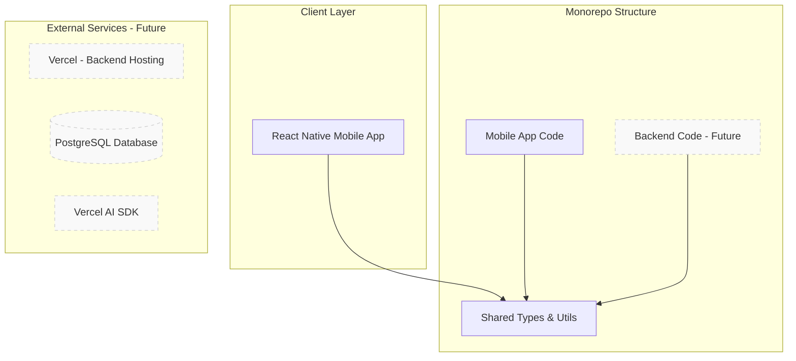
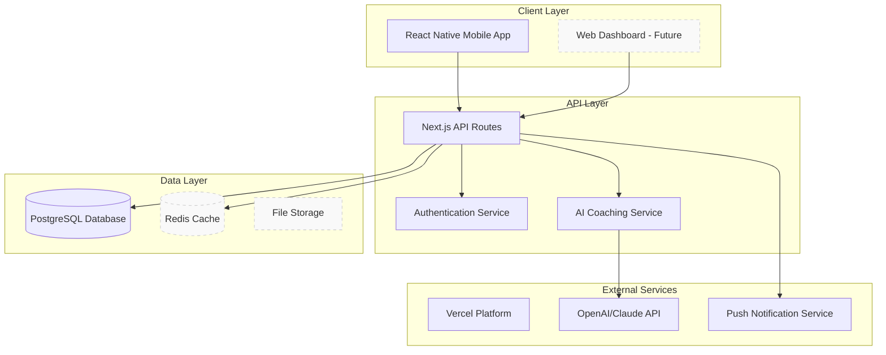
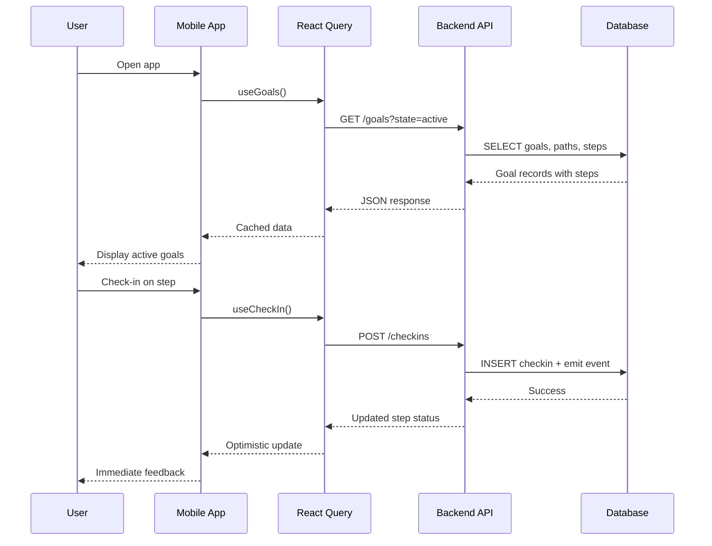
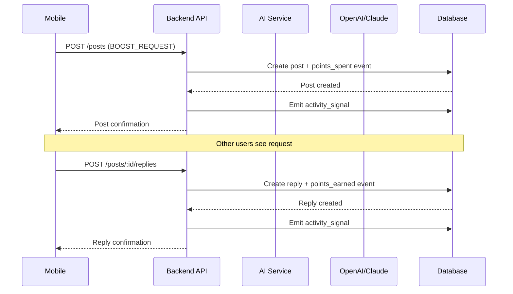

# Better You - Technical Architecture

This document outlines the technical architecture, design decisions, and evolution strategy for the Better You platform.

> **📖 Product Context**: See [`PRODUCT_FOUNDATIONS.md`](../PRODUCT_FOUNDATIONS.md) for product vision, domain language, and core behavioral rules.  
> **📋 Current Status**: See [`STATUS.md`](../STATUS.md) for current project phase, progress, and AI agent handoff information.

## Overview

Better You is designed as a **production-grade, scalable personal development platform** that grows from a simple MVP to a distributed system capable of serving thousands of users.

### Architectural Principles

1. **Mobile-First Product Design**: Mobile is the primary interface, all decisions flow from this
2. **Modular Monolith Before Microservices**: Start with well-organized monolith, decompose only when scale demands it
3. **Async-First for Slow Operations**: External operations and AI processing are non-blocking
4. **Clear Separation of Concerns**: Each layer has distinct responsibilities
5. **No Premature Infrastructure Complexity**: Add complexity only when real usage justifies it
6. **Type Safety Throughout**: End-to-end type safety from database to mobile app
7. **Observable by Design**: Comprehensive logging, metrics, and monitoring from day one

### Architectural North Star

> **Ship a real product fast, then scale ONLY where real usage demands it.**

This architecture is designed to evolve **without collapsing under its own weight**.

---

## System Architecture

### Current State (Phase 1: MVP)



### Target State (Phase 3: Production)



---

## Technology Stack

### Mobile App (React Native)

#### Core Technologies
- **React Native 0.79.5**: Latest stable version with New Architecture
- **Expo SDK 53**: Managed workflow for rapid development
- **TypeScript 5.9.2**: Strict type checking enabled
- **Expo Router**: File-based routing system

#### State Management
- **TanStack React Query**: Server state management and caching
- **React Hooks**: Local component state
- **MMKV**: High-performance local storage
- **Zustand**: Global client state (future)

#### UI & Styling
- **React Native**: Native components
- **Design Tokens**: Consistent theming system
- **Expo Vector Icons**: Icon library
- **React Native Reanimated**: Smooth animations

#### Developer Experience
- **ESLint + Prettier**: Code quality and formatting
- **Husky + lint-staged**: Pre-commit hooks
- **Jest + Testing Library**: Testing framework
- **GitHub Actions**: CI/CD pipeline

#### Internationalization
- **expo-localization**: Device locale detection
- **i18next + react-i18next**: Translation framework
- **Supported locales**: English (en), Brazilian Portuguese (pt-BR)
- **Translation files**: JSON-based locale files in `/mobile/locales/`

### Backend (Next.js) - Future

#### Core Technologies
- **Next.js 15+**: App Router for modern React patterns
- **TypeScript**: Shared types with mobile app
- **Vercel**: Hosting and deployment platform
- **PostgreSQL**: Primary database

#### API Design
- **REST/JSON**: Simple, predictable, versioned endpoints
- **Stateless APIs**: No server-side session state
- **Zod Validation**: Runtime type checking
- **Error Handling**: Consistent error responses
- **Rate Limiting**: API protection
- **Deployed on Vercel**: Serverless, auto-scaling

#### Authentication Strategy
- **Auth0 / Clerk Integration**: Managed auth service (future)
- **JWT Tokens**: Short expiration with refresh rotation
- **Device-based Authentication**: Mobile-optimized flow
- **Biometric Authentication**: On supported devices

#### AI Integration (MVP)
- **Vercel AI SDK**: AI orchestration within Next.js
- **OpenAI/Claude**: LLM providers
- **Async-Safe Processing**: Non-blocking AI operations
- **Context Management**: Conversation history
- **Designed for Extraction**: Can be moved to separate service later

#### Internationalization
- **i18next**: Node.js translation framework
- **Supported locales**: English (en), Brazilian Portuguese (pt-BR)
- **Accept-Language header**: Locale detection from mobile app
- **Localized content**: API errors, email templates, AI prompts

### Database Design

> **⚠️ AUTHORITATIVE DOMAIN MODEL**: See [`PRODUCT_FOUNDATIONS.md`](../PRODUCT_FOUNDATIONS.md) sections 8-10 for the complete, authoritative domain model, entities, relationships, events, and API surface. This section provides implementation context only.

#### Schema Strategy
- **Schema-first**: Database migrations drive development
- **Event-sourced mindset**: Track state transitions as events
- **Normalized Design**: Reduce data duplication
- **Audit Trails**: Track all changes via Adjustment entity
- **Soft Deletes**: Preserve data integrity

#### Implementation Guide

**Backend Setup Steps:**
```bash
# 1. Create backend directory structure:
backend/
├── app/
│   ├── api/
│   │   ├── auth/
│   │   ├── goals/
│   │   ├── steps/
│   │   ├── checkins/
│   │   └── posts/
│   ├── layout.tsx
│   └── page.tsx
├── lib/
│   ├── db.ts         # Database connection
│   ├── auth.ts       # Authentication helpers
│   └── validation.ts # Zod schema validation
├── package.json
├── tsconfig.json
└── next.config.js
```

**Database Creation Workflow:**
```bash
# In backend/ directory:
1. Create package.json with Next.js, TypeScript, @better-you/shared
2. Create next.config.js with TypeScript support
3. Create tsconfig.json extending shared types
4. Create app/layout.tsx and app/page.tsx
5. Create database connection in lib/db.ts
6. Create migrations for all entities from PRODUCT_FOUNDATIONS.md section 8
```

#### Core Entities (Implementation Reference)

**Progress Domain:**
- `users` - User accounts with preferred_locale, preferences, participation phase, points balance
- `availability_profiles` - Weekly capacity in minutes/day (Mon-Sun)
- `goals` - User goals with state machine (queued | draft | active | paused | completed | abandoned | archived)
- `path_templates` - Reusable templates with embedded steps_json and minutes_per_week_estimate
- `path_instances` - Per-goal path with adjustments/overrides
- `step_instances` - Steps with state, type (recurring | one_time), cadence, ordering
- `checkins` - Fast status updates (done | partial | skipped) with difficulty, mood, logText
- `checkpoints` - Periodic reviews (weekly MVP) with 3 quick prompts
- `adjustments` - Explicit change records for behavioral data

**Community Domain:**
- `posts` - Community artifacts (BOOST_REQUEST | PROGRESS_SHARE) with configurable reply behavior
- `post_replies` - Replies to posts (config-driven per post type)
- `reactions` - Emoji/like/short text on posts or replies
- `activity_signals` - Derived, append-only ambient presence events

**System Domain:**
- `user_sessions` - Authentication tokens
- `background_jobs` - Async task queue

#### Key Design Decisions
- **Bilingual from launch**: All strings, templates, and content support en + pt-BR
- **PathTemplate steps are embedded JSON** (MVP speed/flexibility) with localized title/description
- **Goal state changes via explicit transitions** (event-first)
- **Capacity & load tracked in minutes** (UI shows hours when >= 60min)
- **Overload status computed, not stored** (derived from capacity vs load)
- **"Missed" check-ins are system-derived** (invisible, used for re-engagement)
- **Replies configurable per post type** (not hard-coded)

See [`PRODUCT_FOUNDATIONS.md`](../PRODUCT_FOUNDATIONS.md) for complete entity definitions, relationships, and state machines.

### Background Processing (MVP)

#### Current Approach
- **Scheduled Jobs**: Cron-based scheduling
- **DB-backed Job Tables**: Persistent job queue
- **In-process Execution**: Jobs run within Next.js API

#### Use Cases
- **Weekly Summaries**: Generate and send weekly progress reports
- **Reminder Evaluation**: Determine when to send push notifications
- **Habit Consistency Analysis**: Calculate streaks and patterns
- **AI Batch Processing**: Non-urgent AI analysis

#### Implementation
```sql
-- Job queue table
background_jobs (
  id, type, payload, status, 
  scheduled_at, completed_at, created_at
)
```

---

## API Implementation Patterns

### Core API Endpoints Implementation

**Priority endpoints for MVP (see PRODUCT_FOUNDATIONS.md section 10 for complete API surface):**

```typescript
// User & Preferences
GET    /me
PATCH  /me/preferences

// Availability (Capacity)
GET    /availability
PUT    /availability

// Path Templates
GET    /path-templates
GET    /path-templates/:id

// Goals (KEY: state transitions via /transition)
GET    /goals?state=...
POST   /goals/from-template
POST   /goals/:id/transition  # { to: "queued|active|paused|completed|archived" }
GET    /goals/:id

// Steps
POST   /goals/:goalId/steps
PATCH  /steps/:id
POST   /steps/reorder
POST   /steps/:id/retire

// Check-ins (KEY: fast loop with idempotency)
POST   /checkins  # clientEventId for idempotency
GET    /steps/:id/checkins

// Checkpoints & Adjustments
POST   /checkpoints
POST   /adjustments

// Community
GET    /posts?scope=live
POST   /posts
POST   /posts/:id/replies  # Config-driven
POST   /posts/:id/reactions

// Live Community
GET    /activity-signals?since=timestamp

// Recommendations (overload-aware)
GET    /recommendations/goal-state?templateId=...
```

### Implementation Notes

**API Route Creation:**
```bash
# Create API routes in backend/app/api/:
1. app/api/goals/route.ts (GET, POST)
2. app/api/goals/[id]/route.ts (GET, PATCH)
3. app/api/goals/[id]/transition/route.ts (POST)
4. app/api/checkins/route.ts (POST with idempotency)
5. Use Zod schemas from @better-you/shared for validation
6. Return consistent API response format
```

**Mobile App Integration:**
```bash
# Update mobile app to connect to backend:
1. Replace mock data in src/features/*/use*.ts hooks
2. Add API base URL to mobile/.env
3. Create React Query hooks for all endpoints
4. Test offline functionality with React Query cache
```

---

## Internationalization (i18n) Strategy

### Overview

Better You supports **English (en)** and **Brazilian Portuguese (pt-BR)** from launch. All user-facing strings, API responses, and content are bilingual.

### Mobile App Implementation

#### Setup
```bash
pnpm add --filter mobile i18next react-i18next expo-localization
```

#### Structure
```
mobile/
├── locales/
│   ├── en.json       # English translations
│   ├── pt-BR.json    # Brazilian Portuguese translations
│   └── index.ts      # i18n configuration
├── src/
│   └── lib/
│       └── i18n.ts   # i18n initialization
```

#### Translation Files
```json
// mobile/locales/en.json
{
  "onboarding": {
    "welcome": "Welcome to Better You",
    "selectLanguage": "Select your language"
  },
  "lifeDomains": {
    "BODY": "Body",
    "MIND": "Mind",
    "RELATIONSHIPS": "Relationships",
    "WORK": "Work",
    "MONEY": "Money",
    "SERVICE": "Service",
    "SPIRITUALITY": "Spirituality"
  },
  "checkin": {
    "done": "Done",
    "partial": "Partial",
    "skipped": "Skipped"
  }
}

// mobile/locales/pt-BR.json
{
  "onboarding": {
    "welcome": "Bem-vindo ao Better You",
    "selectLanguage": "Selecione seu idioma"
  },
  "lifeDomains": {
    "BODY": "Corpo",
    "MIND": "Mente",
    "RELATIONSHIPS": "Relacionamentos",
    "WORK": "Trabalho",
    "MONEY": "Dinheiro",
    "SERVICE": "Serviço",
    "SPIRITUALITY": "Espiritualidade"
  },
  "checkin": {
    "done": "Concluído",
    "partial": "Parcial",
    "skipped": "Pulado"
  }
}
```

#### Usage in Components
```typescript
import { useTranslation } from 'react-i18next';

function CheckInButton() {
  const { t } = useTranslation();
  
  return (
    <Button title={t('checkin.done')} />
  );
}
```

#### Locale Detection & Persistence
- **Auto-detect**: Use `expo-localization` to detect device locale
- **User preference**: Store selected locale in user profile
- **Fallback**: Default to English if locale not supported

### Backend Implementation

#### Setup
```bash
pnpm add --filter backend i18next i18next-fs-backend
```

#### Structure
```
backend/
├── locales/
│   ├── en.json       # English API responses
│   ├── pt-BR.json    # Portuguese API responses
│   └── index.ts      # i18n configuration
├── lib/
│   └── i18n.ts       # i18n middleware
```

#### API Response Localization
```typescript
// Backend middleware detects Accept-Language header
import { NextRequest } from 'next/server';
import i18next from 'i18next';

export function getLocale(request: NextRequest): string {
  const acceptLanguage = request.headers.get('Accept-Language');
  // Parse and return 'en' or 'pt-BR'
  return acceptLanguage?.startsWith('pt') ? 'pt-BR' : 'en';
}

// API route usage
export async function POST(request: NextRequest) {
  const locale = getLocale(request);
  const t = await i18next.getFixedT(locale);
  
  return Response.json({
    error: {
      code: 'OVERLOAD_DETECTED',
      message: t('errors.overload_detected')
    }
  });
}
```

### Shared Package

#### Localized Types
```typescript
// shared/src/types.ts
export type Locale = 'en' | 'pt-BR';

// Flexible type that scales to additional languages
export type LocalizedString = Record<Locale, string>;

// Validation helper
export function validateTranslations(obj: LocalizedString): boolean {
  const requiredLocales: Locale[] = ['en', 'pt-BR'];
  return requiredLocales.every(locale => 
    obj[locale] && obj[locale].trim().length > 0
  );
}

// Helper to get localized string with fallback
export function getLocalizedString(
  localized: LocalizedString,
  locale: Locale
): string {
  return localized[locale] || localized.en;
}

export interface LocalizedPathTemplate {
  id: string;
  title: LocalizedString;
  description: LocalizedString;
  steps_json: Array<{
    title: LocalizedString;
    description: LocalizedString;
    cadence: string;
    minutes_estimate: number;
  }>;
  minutes_per_week_estimate: number;
}
```

### Database Schema

```sql
-- Users table includes preferred locale
CREATE TABLE users (
  id UUID PRIMARY KEY,
  email VARCHAR(255) UNIQUE NOT NULL,
  preferred_locale VARCHAR(10) DEFAULT 'en',
  -- other fields...
  created_at TIMESTAMP DEFAULT NOW()
);

-- Path templates with localized content using JSONB (scalable)
CREATE TABLE path_templates (
  id UUID PRIMARY KEY,
  title JSONB NOT NULL,  -- {"en": "Title", "pt-BR": "Título"}
  description JSONB NOT NULL,  -- {"en": "Description", "pt-BR": "Descrição"}
  steps_json JSONB NOT NULL,  -- Contains localized step titles/descriptions
  minutes_per_week_estimate INTEGER NOT NULL,
  created_at TIMESTAMP DEFAULT NOW(),
  -- Constraints ensure required locales are present
  CONSTRAINT title_has_required_locales CHECK (title ? 'en' AND title ? 'pt-BR'),
  CONSTRAINT description_has_required_locales CHECK (description ? 'en' AND description ? 'pt-BR')
);

-- Posts support user's preferred locale
CREATE TABLE posts (
  id UUID PRIMARY KEY,
  user_id UUID REFERENCES users(id),
  type VARCHAR(50) NOT NULL,
  body TEXT NOT NULL,
  locale VARCHAR(10) NOT NULL,  -- Track post language
  created_at TIMESTAMP DEFAULT NOW()
);
```

### Content Localization Strategy

#### Static Content (MVP)
- UI labels and buttons
- Error messages
- System notifications
- Life domain names and descriptions
- Onboarding flow text

#### Dynamic Content (MVP)
- PathTemplate titles and descriptions
- Step instructions
- Checkpoint prompts
- API error messages

#### User-Generated Content (Future)
- Posts remain in user's chosen language
- Optional auto-translation for cross-language community interaction
- Translation powered by AI service (post-MVP)

### Cultural Considerations

#### Brazilian Portuguese Adaptations
- **Formality**: Use informal "você" form, not formal "o senhor/a senhora"
- **Tone**: Warm and encouraging, matching English tone
- **Spirituality domain**: Culturally sensitive; inclusive of both religious and secular interpretations
- **Time formats**: Use 24-hour format common in Brazil
- **Date formats**: DD/MM/YYYY for pt-BR, MM/DD/YYYY for en
- **Currency**: Display in R$ for pt-BR users when relevant

#### Language Switching
- Users can change language at any time in settings
- Mobile app switches immediately (no reload required)
- Backend respects Accept-Language header on all requests
- User preference stored in profile, persisted across devices

### Testing Strategy

#### Translation Coverage
- Ensure 100% translation coverage for both locales
- Automated validation: `pnpm i18n:validate` (CI/CD integrated)
- Coverage reporting: `pnpm i18n:coverage`
- Visual regression tests for text overflow in different languages

#### Locale Testing
- Test all flows in both English and Portuguese
- Verify date/time formatting per locale
- Test API responses with different Accept-Language headers
- Validate database queries return correct localized content from JSONB
- Test JSONB constraints prevent incomplete translations

### Scalability Considerations

#### Adding New Languages (Post-MVP)
The JSONB-based approach scales efficiently:

1. **Update type definitions** in `shared/src/types.ts`:
   ```typescript
   export type Locale = 'en' | 'pt-BR' | 'es' | 'fr';
   ```

2. **Update database constraints** (one-time migration):
   ```sql
   ALTER TABLE path_templates DROP CONSTRAINT title_has_required_locales;
   ALTER TABLE path_templates DROP CONSTRAINT description_has_required_locales;
   
   -- Add new constraint including new locales
   ALTER TABLE path_templates
   ADD CONSTRAINT title_has_required_locales 
     CHECK (title ? 'en' AND title ? 'pt-BR' AND title ? 'es');
   ```

3. **Add translation files**: Create `mobile/locales/es.json`, `backend/locales/es.json`

4. **Update validation scripts**: Add new locale to `LOCALES` array

No code refactoring needed - the flexible type system adapts automatically.

---

## Data Flow

> **⚠️ AUTHORITATIVE API SURFACE**: See [`PRODUCT_FOUNDATIONS.md`](../PRODUCT_FOUNDATIONS.md) section 10 for the complete, locked MVP API surface. The diagrams below illustrate implementation patterns but may reference example endpoints. Always refer to PRODUCT_FOUNDATIONS.md for actual endpoint definitions.

### Mobile App Data Flow



### AI Coaching Flow



---

## Design Decisions

### 1. Monorepo Structure

**Decision**: Use npm workspaces for monorepo management

**Rationale**:
- Shared types between mobile and backend
- Consistent tooling and dependencies
- Simplified deployment coordination
- Better code reuse

**Alternatives Considered**:
- Separate repositories (harder to maintain consistency)
- Lerna (more complex than needed)
- Yarn workspaces (npm workspaces are sufficient)

### 2. Mobile-First Architecture

**Decision**: Build mobile app first, backend second

**Rationale**:
- Mobile is the primary user interface
- Can prototype features with mock data
- Validates user experience early
- Backend can be designed around mobile needs

**Trade-offs**:
- Some features require backend integration
- Mock data needs to be maintained
- May need to refactor mobile code when backend is ready

### 3. React Query for State Management

**Decision**: Use React Query for server state, React hooks for local state

**Rationale**:
- Excellent caching and synchronization
- Optimistic updates out of the box
- Background refetching
- Error handling and retry logic
- Large community and ecosystem

**Alternatives Considered**:
- Redux Toolkit Query (more complex setup)
- SWR (less feature-rich)
- Custom fetch hooks (reinventing the wheel)

### 4. Expo Managed Workflow

**Decision**: Use Expo managed workflow with custom development builds when needed

**Rationale**:
- Faster development iteration
- Excellent developer experience
- Easy deployment with EAS
- Can eject to bare workflow if needed

**Trade-offs**:
- Some native modules not available
- Bundle size slightly larger
- Less control over native code

### 5. PostgreSQL Database

**Decision**: Use PostgreSQL as primary database

**Rationale**:
- Excellent JSON support for flexible schemas
- Strong consistency guarantees
- Mature ecosystem and tooling
- Good performance for expected scale
- Vercel Postgres integration

**Alternatives Considered**:
- MongoDB (less structured, eventual consistency)
- SQLite (not suitable for multi-user)
- MySQL (less JSON support)

### 6. Next.js App Router

**Decision**: Use Next.js with App Router for backend

**Rationale**:
- Modern React patterns (Server Components)
- Excellent TypeScript support
- Built-in API routes
- Vercel deployment optimization
- Strong ecosystem

**Trade-offs**:
- App Router is relatively new
- Some features still in beta
- Learning curve for Server Components

---

## Scalability Strategy

### Phase 1: MVP (Current)
- **Users**: 1-100
- **Architecture**: Mobile app with mock data
- **Deployment**: Expo development builds
- **Database**: None (local storage only)

### Phase 2: Backend Integration
- **Users**: 100-1,000
- **Architecture**: Mobile + Next.js API + PostgreSQL
- **Deployment**: Vercel for backend, EAS for mobile
- **Database**: Single PostgreSQL instance

### Phase 3: Production Scale
- **Users**: 1,000-10,000
- **Architecture**: Add Redis caching, background jobs
- **Deployment**: Multi-environment setup
- **Database**: Connection pooling, read replicas

### Phase 4: Distributed System
- **Users**: 10,000+
- **Architecture**: Microservices, event-driven
- **Deployment**: Container orchestration
- **Database**: Sharding, multiple databases

## Phase 2+ Evolution Strategy

### AI Service Extraction
When AI complexity grows beyond Next.js capabilities:

- **Python Service**: Extract AI logic to dedicated service
- **Async Communication**: HTTP or message queue based
- **Capabilities**:
  - Batch analysis and insights
  - Long-running AI workflows
  - Advanced personalization algorithms
  - ML model training and inference

### Messaging & Eventing Layer
Introduced when service decoupling becomes necessary:

#### Redis Integration
- **Caching**: Frequently accessed data
- **Rate Limiting**: API protection
- **Pub/Sub**: Real-time event distribution
- **Session Storage**: User session management

#### RabbitMQ Integration
- **Durable Workflows**: Reliable job processing
- **Decoupled Consumers**: AI, notifications, analytics
- **Dead Letter Queues**: Failed job handling
- **Priority Queues**: Urgent vs. batch processing

### Real-Time Layer
Activated when community features justify the complexity:

#### WebSocket Integration
- **Group Activity Updates**: Live habit sharing
- **Challenge Participation**: Real-time competition
- **Presence Indicators**: Online status
- **Live Coaching Sessions**: Interactive AI coaching

#### Implementation Strategy
- Start with simple polling
- Upgrade to Server-Sent Events
- Full WebSocket only when bidirectional communication is needed

### Containerization & Orchestration Timeline

#### Docker Introduction
When service isolation becomes meaningful:
- Multiple services need coordination
- Development environment consistency required
- Deployment complexity justifies containerization

#### Kubernetes Introduction
When horizontal scaling is required:
- Traffic patterns demand auto-scaling
- Service mesh benefits outweigh complexity
- Infrastructure ownership becomes explicit goal
- Multi-region deployment needed

---

## Security Considerations

### Authentication
- JWT tokens with short expiration
- Refresh token rotation
- Device-based authentication
- Biometric authentication on mobile

### Data Protection
- Encryption at rest and in transit
- Personal data anonymization
- GDPR compliance
- Regular security audits

### API Security
- Rate limiting per user/IP
- Input validation with Zod
- SQL injection prevention
- CORS configuration

---

## Observability & Reliability

### Application Monitoring
- **Error Tracking**: Sentry for exception monitoring
- **Performance Monitoring**: API response times, mobile app performance
- **User Analytics**: Privacy-focused usage patterns
- **Structured Logging**: Consistent log format across services

### Infrastructure Monitoring
- **Database Performance**: Query times, connection pool usage
- **API Endpoint Health**: Uptime, response times, error rates
- **Resource Usage**: Memory, CPU, storage utilization
- **Network Latency**: Client-to-API, service-to-service

### Business Metrics
- **User Engagement**: Daily/weekly active users, session duration
- **Habit Completion Rates**: Success patterns, dropout analysis
- **AI Coaching Effectiveness**: User satisfaction, engagement with suggestions
- **Feature Adoption**: New feature usage, conversion funnels

### Reliability Patterns
- **Retry Strategies**: Exponential backoff for async workflows
- **Circuit Breakers**: Prevent cascade failures
- **Graceful Degradation**: Core features work when AI/external services fail
- **Queue Depth Monitoring**: Background job processing health

---

## Development Workflow

### Git Strategy
- **Main branch**: Production-ready code
- **Feature branches**: Individual features
- **Pull requests**: Required for main branch
- **Conventional commits**: Automated changelog

### Testing Strategy
- **Unit tests**: Critical business logic
- **Integration tests**: API endpoints
- **E2E tests**: Critical user flows
- **Performance tests**: Load testing

### Deployment Pipeline
1. **Development**: Local development with hot reload
2. **Preview**: Automated preview deployments
3. **Staging**: Full integration testing
4. **Production**: Blue-green deployments

---

## Future Considerations

### Potential Enhancements
- **Web Dashboard**: Admin interface for power users
- **Real-time Features**: Live coaching sessions
- **Advanced Analytics**: ML-powered insights
- **Third-party Integrations**: Fitness trackers, calendars
- **Multi-tenancy**: Team and organization features

### Technical Debt Management
- Regular dependency updates
- Code quality metrics
- Performance budgets
- Security vulnerability scanning

### Scaling Challenges
- Database query optimization
- Mobile app bundle size
- AI response latency
- Push notification delivery
- Data consistency across devices

---

## Conclusion

This architecture embodies the principle: **"Ship a real product fast, then scale ONLY where real usage demands it."**

The design balances **simplicity with scalability**, starting as a mobile-first modular monolith and evolving into a distributed system only when user growth and feature complexity justify the additional infrastructure.

Key architectural decisions prioritize:
- **Rapid MVP delivery** over premature optimization
- **Modular monolith** over immediate microservices
- **Async-first design** for external operations
- **Clear evolution path** without architectural rewrites

This approach ensures Better You can grow sustainably from hundreds to thousands of users while maintaining high code quality, user experience, and development velocity.

---

_Last Updated: 2026-01-25_  
_Next Review: After Phase 2 completion_